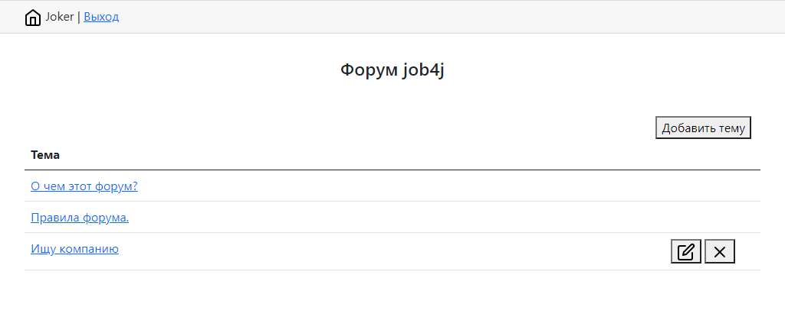
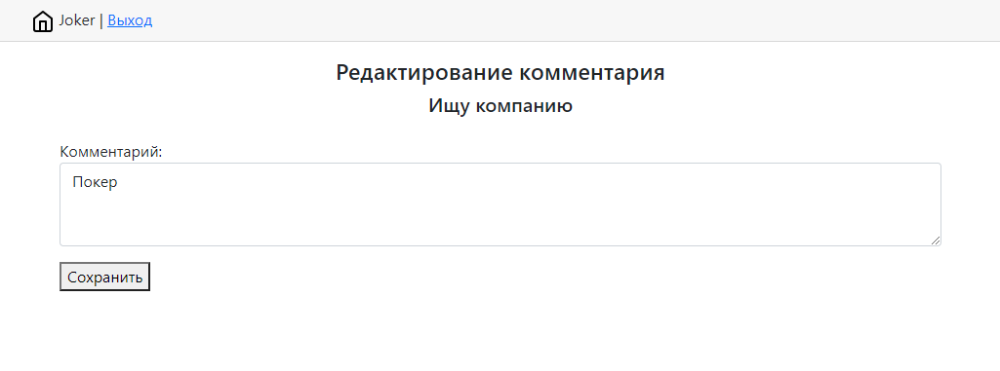
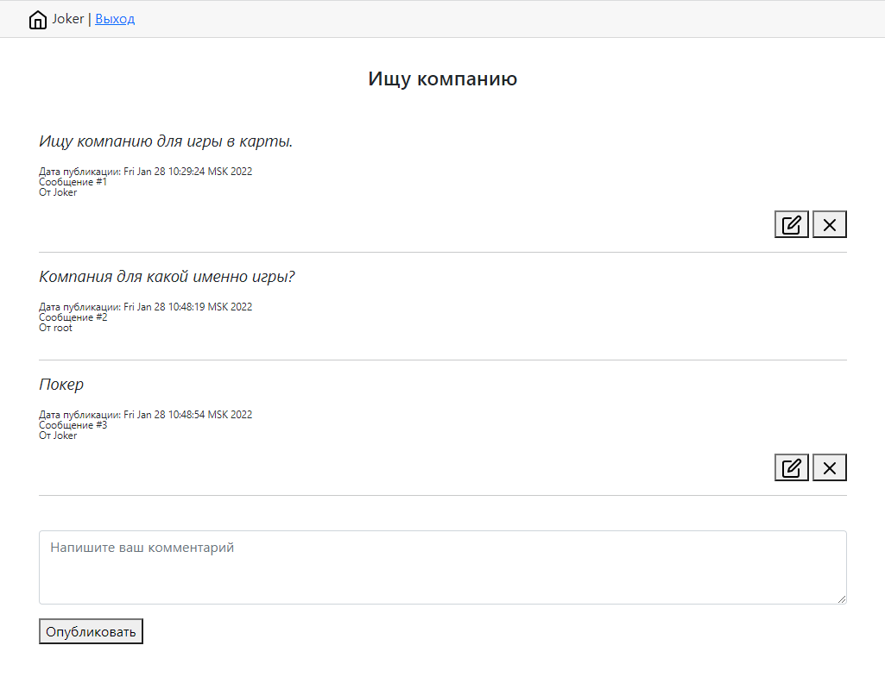

# job4j_forum

Это учебный проект, классическое приложение — форум.  
Проект реализован по шаблону MVS и использует spring framework (boot, mvs, data, security).
В качестве базы данных postgresql.
Пользователи разделены по правам на "user" и "admin".  

В проекте реализован функционал:  
* Регистрация;
* Авторизация;
* Добавление новой темы любым авторизованным пользователем;
* Редактирование темы либо пользователем, добавившим её ранее, либо админом;
* Удаление темы либо пользователем, добавившим её ранее, либо админом;
* Добавление комментария к теме;
* Редактирование/удаление своего комментария;
* Выход из системы авторизованного пользователя.

Доступ ко всем страницам, кроме регистрации и авторизации, неавторизованным пользователям запрещён.

index.jsp - главная страница - список тем.

reg.jsp - регистрация пользователя.

login.jsp - авторизация пользователя.

edit.jsp - редактирование темы.

post.jsp - тема и обсуждения.

create.jsp - создание темы.
